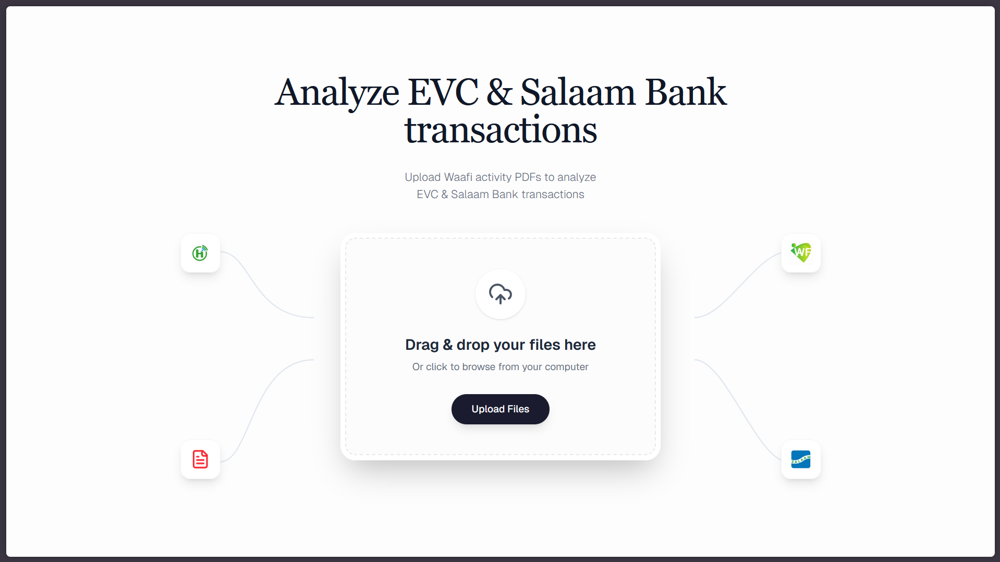
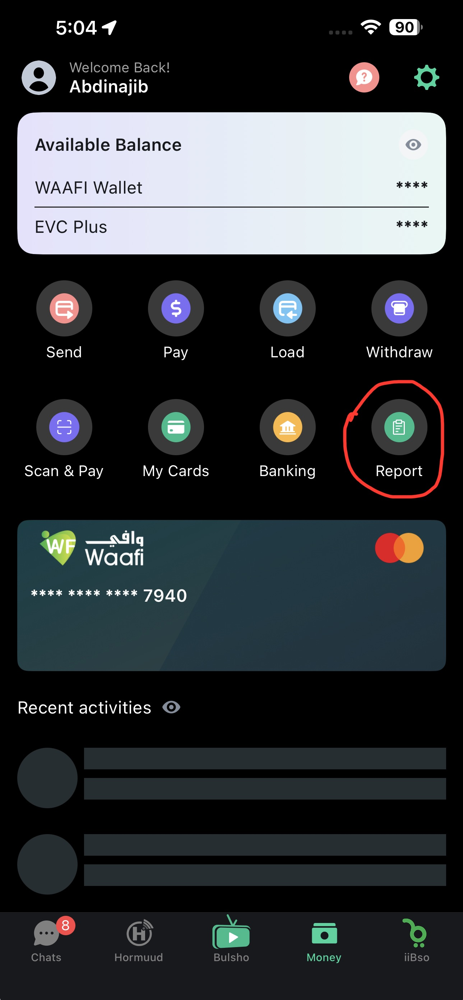
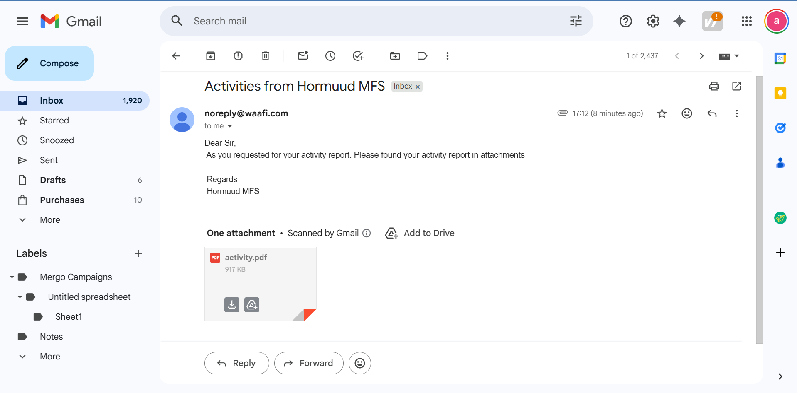
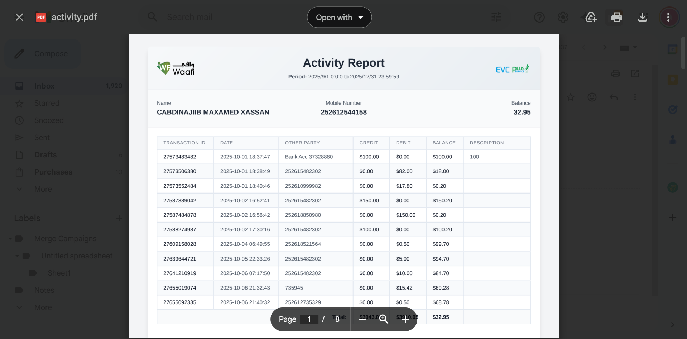

# [EVC Analyzer](https://evc.caawi.me/)

The way you can analyze your EVC and Salaam Bank transactions from Waafi activity PDFs.

---

## 🚀 How It Works

Follow this simple guide to download your transaction history and analyze it with our tool.

### Step 1 & 2: Request Your Report
Open the **Waafi app** and tap the **"Report"** icon. Select your date range, enter your email address, and tap **"Apply Filter"** to send the report.

  
  

 

### Step 3: Download the PDF
Check your email inbox for a message from **Hormuud MFS**. Open it and download the **activity.pdf** file.

*(The PDF will look like this)*

### Step 4: Upload to Analyzer
Go to the [EVC Analyzer website](https://evc.caawi.me/). Drag and drop your **activity.pdf** file to instantly visualize your spending.

---

## Tech Stack

Built with 💖 by **[Abdinajib](https://github.com/najiibmohamed11)**

